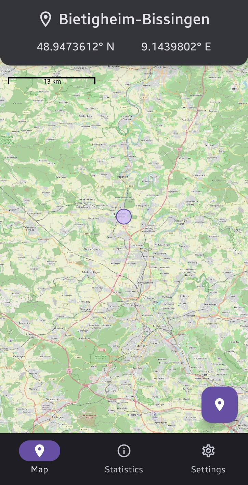
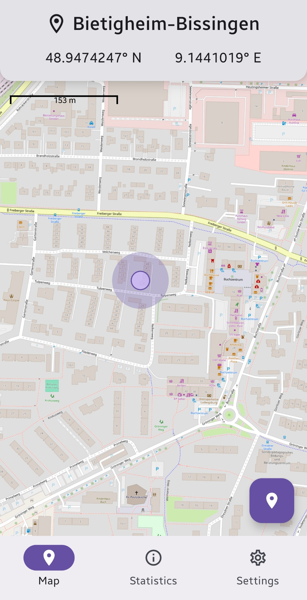
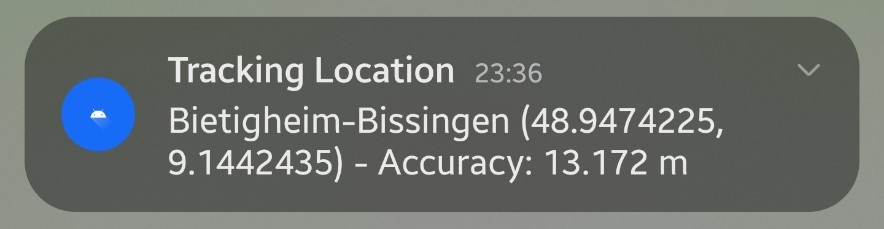
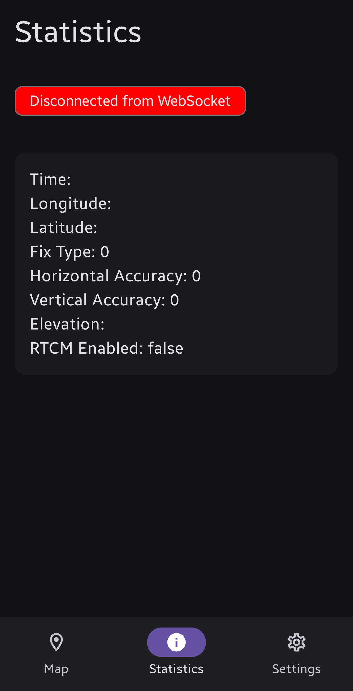
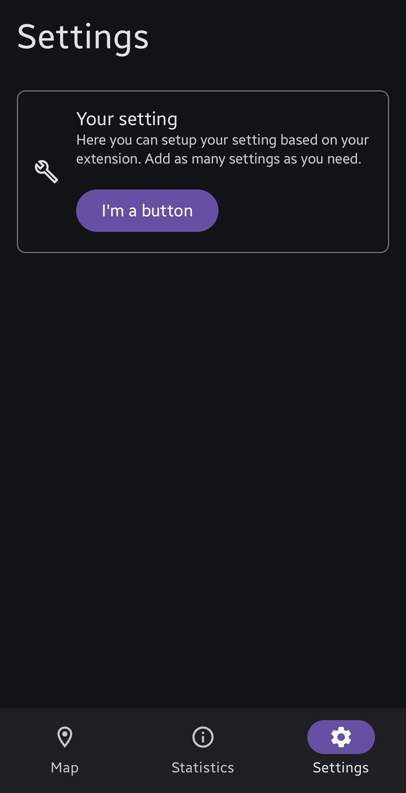

# GNSS Tracking App

## Description

This project presents a framework for developing a GNSS tracking app for the ASHCI course at
Heilbronn University of Applied Sciences (HHN). Designed for Android 11+ and leveraging
OpenStreetMap tools for Android, the app offers an intuitive interface for tracking GNSS data and
visualizing locations on a map in real-time. It also provides real-time location notifications and
detailed statistical insights.

The app is built with the latest version of Kotlin and utilizes the K2 compiler, which enhances
compile speed.

## Used Libraries

- [osmdroid - OpenStreetMap-Tools for Android](https://github.com/osmdroid/osmdroid)
- [Jetpack Compose with Material 3](https://developer.android.com/compose)
- [Ktor for creating HTTP requests and websocket connections](https://ktor.io/)
- [Koin - Kotlin & Kotlin Multiplatform Dependency Injection framework](https://insert-koin.io/)
- [Gson - Converts Java Objects into JSON and back](https://github.com/google/gson)

## Screenshots

## Features

### Implemented

- Map Screen for Location Tracking
    - Displays your location as a circle on the map, with accuracy support
    - Scale overlay
    - Pinch-to-zoom functionality for map navigation
    - Use the Geocoder API to find your location by tapping the button at the bottom right
- Real-Time Location Notifications
- WebSocket connection support to interface with a GNSS module
- Statistics Screen to visualize GNSS data
- Settings Screen for app customization options

### Not implemented

- [ ] Statistics screen for visualizing GNSS data
- [ ] Settings screen for customizing the app

## Installation

### Prerequisites

- [Android Studio](https://developer.android.com/studio)

### Configuration

#### Websocket Connection

1. Connect the microcontroller with the GNSS module via a Mobile Hotspot
2. Retrieve the microcontroller's IP address
3. Set the IP address in the `webSocketIp` variable
   in [BaseApplication.kt](app/src/main/java/de/hhn/gnsstrackingapp/BaseApplication.kt)
4. Update the IP address
   in [network_security_config.xml](app/src/main/res/xml/network_security_config.xml) to allow
   the insecure WebSocket connection, as required by Android's security policy
5. Build and run the app on your device

## Known Issues

- [ ] No unit testing story
